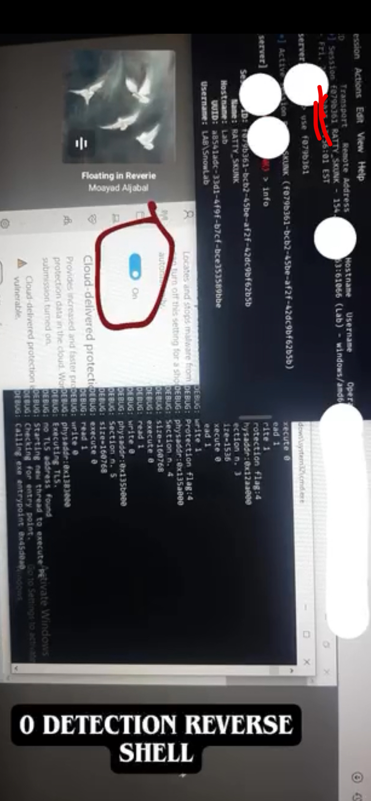
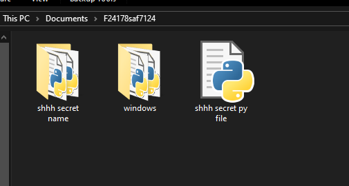
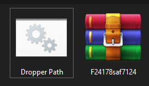
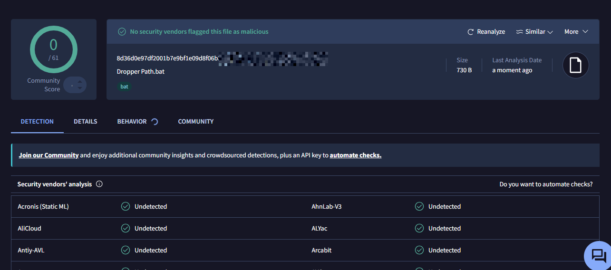

# Undetectable Backdoor via Memory Injection

## Intro

hey delulu's, it's ya delulu making a research drop.

so full disclaimer: this is purely educational. i'm not sharing any actual files, code, or samples—just the research findings. don't do illegal stuff with this, obviously.

i've been deep in the rabbit hole for like a month now researching memory injection techniques and finally got something solid working. turns out you can use Python libraries to memory-inject C2 payloads and just... ghost past everything. no detections.

tested it across basically every major C2 framework (Cobalt Strike, MetaSploit, etc.) and it works seamlessly. i also ran it against Windows 10/11 fully updated with third-party antivirus running. completely undetected.

even built a dropper that keeps everything in-memory so there's nothing on disk to reverse engineer. the injection library encrypts and fragments the payload, then melts it into process memory. forensics nightmare.

## Why Memory Injection Hits Different

**Antivirus is Lazy**

- Windows Defender and most AV solutions primarily scan disk. they're not doing deep memory inspection—it's too expensive computationally
- injected payloads leave almost zero on-disk artifacts
- even if they scan memory, you're dealing with fragmented, encrypted data that doesn't match known signatures

**Process Masquerading**

- DLL injection lets your shellcode run inside trusted system processes (explorer.exe, svchost.exe, etc.)
- the process itself looks legitimate, so behavioral detection doesn't flag it
- monitors see a normal process doing normal things, not malicious code executing

**Payload Obfuscation**

- the injection library encrypts the payload before it touches memory
- dropper and payload are separated—delivery mechanism doesn't match execution mechanism
- once injected, the payload structure gets fragmented and obfuscated so deeply that static analysis tools can't reconstruct it

## Technical Breakdown

### Attack Chain

1. **Dropper** — kicks off the injection sequence, exists on disk briefly, then cleans up
2. **Injection Library** — handles encryption, memory allocation, shellcode execution, and its own obfuscation
3. **C2 Payload** — the actual agent, lives entirely in memory

### What I Tested

- Windows 10 (latest)
- Windows 11 (latest)
- Multiple third-party AV vendors
- Windows Defender enabled

**Result:** 0 detections. clean sweep.

## The Techniques

- **Direct code injection** — allocating and executing shellcode without traditional DLL loading
- **Process injection/hollowing** — hijacking legitimate process memory space
- **Runtime payload encryption** — decrypted only in memory, never hits disk
- **AMSI/ETW evasion** — operating below managed-code instrumentation layers
- **Artifact minimization** — dropper self-destructs, no registry modifications, no suspicious file operations

## What This Means

Current defensive tools have a massive blind spot: they're not watching memory effectively. organizations need to start thinking about:

- actual real-time memory inspection tools
- behavior-based detection (not just signatures)
- kernel-level process monitoring
- EDR solutions that can catch anomalous memory allocation patterns
- forensic memory analysis as part of incident response

## References
- [MITRE ATT&CK: Process Injection (T1055)](https://attack.mitre.org/techniques/T1055/)
- Windows kernel memory management docs

---

**real disclaimer:** don't use this for anything illegal. this is research. period.
